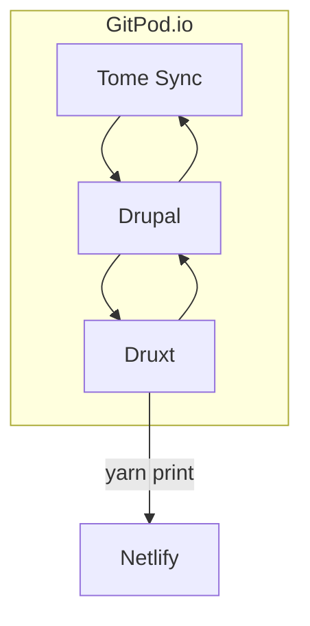

# Serverless

[gitpod.io/#github.com/Decipher/example-druxt-blog](https://gitpod.io/#github.com/Decipher/example-druxt-blog)

```mermaid { theme: 'neutral' }
graph TD
  subgraph GitPod.io
    Tome["Tome Sync"]-->Drupal
    Drupal-->Druxt
    Druxt-->Drupal
    Drupal-->Tome
  end
  Druxt-- yarn print -->Netlify
```

<!--
-->
